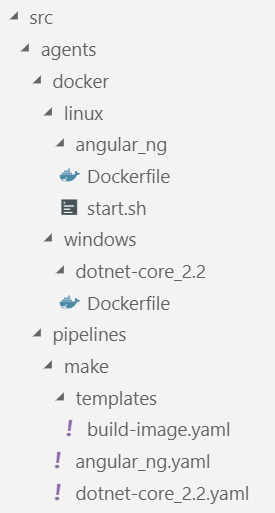
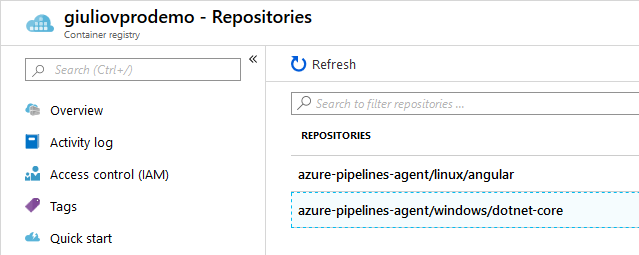

# Meta-pipelines - Part 3 - Build and Registry

In the previous instalments we examined a possible Dockerfile for an Azure Pipelines/TFS Agent. In this post, we will explore the pipeline that can automatically build such custom agent images.

## Docker Registry

To automate properly we need a Docker Registry where storing the Docker images we build.
There are many advantages in using a registry, in our scenario it enables:

- pulling an image version built years ago
- distribution of images to multiple hosts
- caching locally base images, allowing air gap builds

For the purpose of this series we will use Azure Container Registry (ACR for short), but there are many options; for example I used successfully [ProGet](https://inedo.com/proget).
To setup your ACR, see the [quick-starts](https://docs.microsoft.com/en-us/azure/container-registry/).

## Image Build Pipeline

The idea is to define a build pipeline for each flavour of dockerised build agent: for example, an agent for .Net Core 2.2, one for .Net Core 3.0, etc. Such build pipeline will build the docker image and push it to a Docker Registry.
A deploy pipeline takes care of starting containers on the host machines after pulling the image from the registry. This is a little complicated as we must stop any running container of that flavour and run the required instances.

As the Dockerfile works either on Windows or Linux, it is important to add the proper `Agent.OS` demand on these pipelines so that they execute on hosts with matching operating system.

As we foresee to have a number of specialized agents, we want to maintain as little code as possible. Here I will use an Azure Pipelines YAML template, so that each specific YAML build simply sets the parameters value required.

```yaml
parameters:
  os: ''
  toolchain: ''
  toolchain_version: ''
  repo_docker_path: 'src/agents/docker'
  image_name_prefix: 'azure-pipelines-agent'
  docker_registry_connection: 'mydemo.azurecr.io'

steps:
- task: Docker@2
  displayName: Login to Docker Registry
  inputs:
    command: login
    containerRegistry: '${{ parameters.docker_registry_connection }}'
- task: Docker@2
  displayName: 'Building ${{ parameters.toolchain }} ${{ parameters.toolchain_version }} image'
  inputs:
    command: buildAndPush
    repository: '${{ parameters.image_name_prefix }}/${{ parameters.os }}/${{ parameters.toolchain }}'
    dockerFile: '${{ parameters.repo_docker_path }}/${{ parameters.os }}/${{ parameters.toolchain }}_${{ parameters.toolchain_version }}/Dockerfile'
    imageName: '${{ parameters.image_name_prefix }}/${{ parameters.os }}/${{ parameters.toolchain }}-${{ parameters.toolchain_version }}'
    tags: |
      ${{ parameters.toolchain_version }}
      latest
```

The template is straightforward: it runs docker twice, one to login to a Docker Registry (ACR in this example) and next to build the image from the Docker file and push the image to the Registry.

Using the template is also simple, invoke the template passing the parameters.
You will note the **MakeAgents** queue; you will probably remember from the first instalment that this pool has the agents running on host machines. The demand for `Windows_NT` will pick the right host type matching the Dockerfile requirement.

```yaml
trigger:
  batch: true
  paths:
    include:
      - src/agents/*
pool:
  name: MakeAgents
  demands:
  - agent.os -equals Windows_NT
steps:
- template: templates/build-image.yaml
  parameters:
    os: 'windows'
    toolchain: 'dotnet-core'
    toolchain_version: '2.2'
```

To build a Linux agent we use the same template, just change the invocation.

```yaml
trigger:
  batch: true
  paths:
    include:
      - src/agents/*
pool:
  name: MakeAgents
  demands:
  - agent.os -equals Linux
steps:
- template: templates/build-image.yaml
  parameters:
    os: 'linux'
    toolchain: 'angular'
    toolchain_version: 'ng'
```

The file organisation reflects the naming conventions:



The _agents_ folder has everything needed to build and deploy the agents, _pipelines_ has the Azure Pipelines scripts in the form of YAML definitions and templates, distinguishing between _make_ and _deploy_ categories, i.e. make new Docker images versus starting new Docker containers.
The _docker_ folders is referenced by the pipelines looking for the Docker context, in it we keep _windows_ and _linux_ images apart and finally we have a folder for each Dockerfile and referred scripts.

## What's next

If we run the above pipelines successfully, we should see, in Azure Portal, two new Repositories (images) in the chosen Docker Registry.



In future posts we will use these images to create Azure Pipelines Agents.
